# 一：运行环境
## 1.1.浏览器的组成：
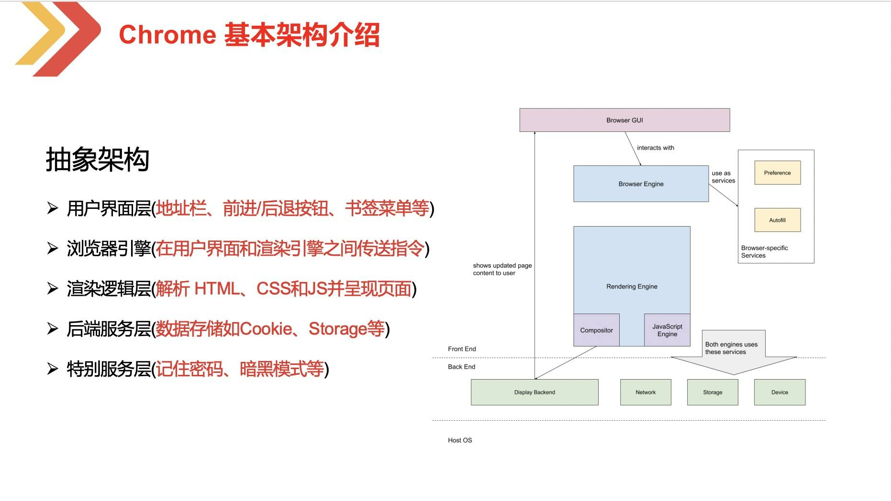 
## 1.2. 从输入url到页面显示之间发生了什么(浏览器部分)？
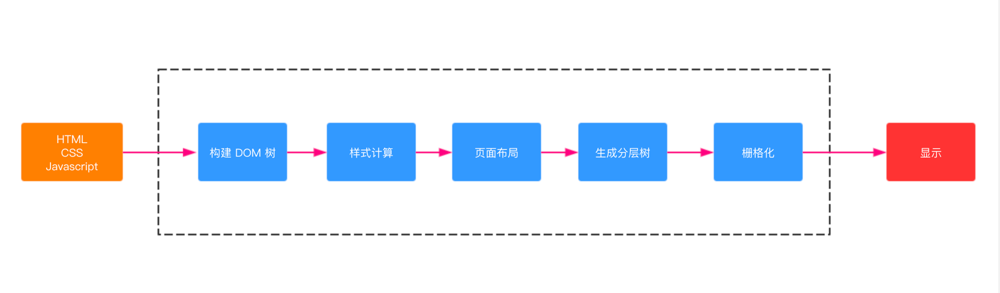    
    
    1.解析HTML，生成DOM树
    2.解析CSS，生成CSSOM树
    3.将DOM树和CSSOM树结合，生成渲染树(Render Tree)
    4.Layout(回流)：根据生成的渲染树，进行回流(Layout)，得到节点的几何信息（位置，大小）
    5.Painting(重绘)：根据渲染树以及回流得到的几何信息，得到节点的绝对像素
    6.Display：将像素发送给GPU，展示在页面上。（这一步其实还有很多内容，比如会在GPU将多个合成层合并为同一个层，并展示在页面中。而css3硬件加速的原理则是新建合成层，这里我们不展开，之后有机会会写一篇博客）

链接阅读：

[Chrome 页面呈现原理与性能优化之公司级分享总结(内附完整ppt)](https://juejin.im/post/5e572a34518825490f722b9e#heading-0)    

[浏览器的渲染原理简介](https://coolshell.cn/articles/9666.html)

## 1.3 重绘和回流：
>回流：当我们对 DOM 的修改引发了 DOM 几何尺寸的变化（比如修改元素的宽、高或隐藏元素等）时，浏览器需要重新计算元素的几何属性（其他元素的几何属性和位置也会因此受到影响），然后再将计算的结果绘制出来。这个过程就是回流（也叫重排）。

>重绘：当我们对 DOM 的修改导致了样式的变化、却并未影响其几何属性（比如修改了颜色或背景色）时，浏览器不需重新计算元素的几何属性、直接为该元素绘制新的样式（跳过了上图所示的回流环节）。这个过程叫做重绘。 由此我们可以看出，重绘不一定导致回流，回流一定会导致重绘。

    常见的会导致回流的元素：
        1.常见的几何属性有 width、height、padding、margin、left、top、border 等等。
        2.最容易被忽略的操作：获取一些需要通过即时计算得到的属性,当你要用到像这样的属性：offsetTop、offsetLeft、 offsetWidth、offsetHeight、scrollTop、scrollLeft、scrollWidth、scrollHeight、clientTop、clientLeft、clientWidth、clientHeight 时，浏览器为了获取这些值，也会进行回流。
        3.当我们调用了 getComputedStyle 方法，或者 IE 里的 currentStyle 时，也会触发回流。原理是一样的，都为求一个“即时性”和“准确性”

## 1.4 如何避免触发回流和重绘：
    CSS：

        1.避免使用table布局。
        2.尽可能在DOM树的最末端改变class。
        3.避免设置多层内联样式。
        4.将动画效果应用到position属性为absolute或fixed的元素上
        5.避免使用CSS表达式（例如：calc()）
        CSS3硬件加速（GPU加速）

    JavaScript：

        1.避免频繁操作样式，最好一次性重写style属性，或者将样式列表定义为class并一次性更改class属性
        2.避免频繁操作DOM，创建一个documentFragment，在它上面应用所有DOM操作，最后再把它添加到文档中
        3.也可以先为元素设置display: none，操作结束后再把它显示出来。因为在display属性为none的元素上进行的DOM操作不会引发回流和重绘
        4.避免频繁读取会引发回流/重绘的属性，如果确实需要多次使用，就用一个变量缓存起来
        5.对具有复杂动画的元素使用绝对定位，使它脱离文档流，否则会引起父元素及后续元素频繁回流

链接阅读:

[重绘回流](https://juejin.im/post/5d690c726fb9a06b155dd40d#heading-40)

## 1.5 js文件为什么放在html文件的最后？
    原因：js 文件会阻塞页面后面的内容（包括页面的渲染，和资源的下载）。
    为了防止出现长时间的白屏所以需要放在最后。
## 1.6 js引擎的垃圾回收是如何实现的：
    标记回收法：
## 1.7.window.load和DomcContentLoad有什么区别？
    区别：
        window.load需要等待文件的所有资源包括视频，图片全部加载回来才进行触发。
        DomContentLoad不需要等待,样式，脚本视频，图片等资源加载完成。

## 1.8 js运行机制：
### 1.8.1 事件循环：

### 1.8.2 运行时的宏任务和微任务：
    常见宏任务：
        script，setTimeout，setInterval
    常见微任务：
        Promise，process.nextTick

链接阅读：

[JS事件循环机制（event loop）之宏任务/微任务](https://juejin.im/post/5b498d245188251b193d4059#heading-0)

## 1.9 常见的Dom和Bom操作
### 1.9.1 dom操作
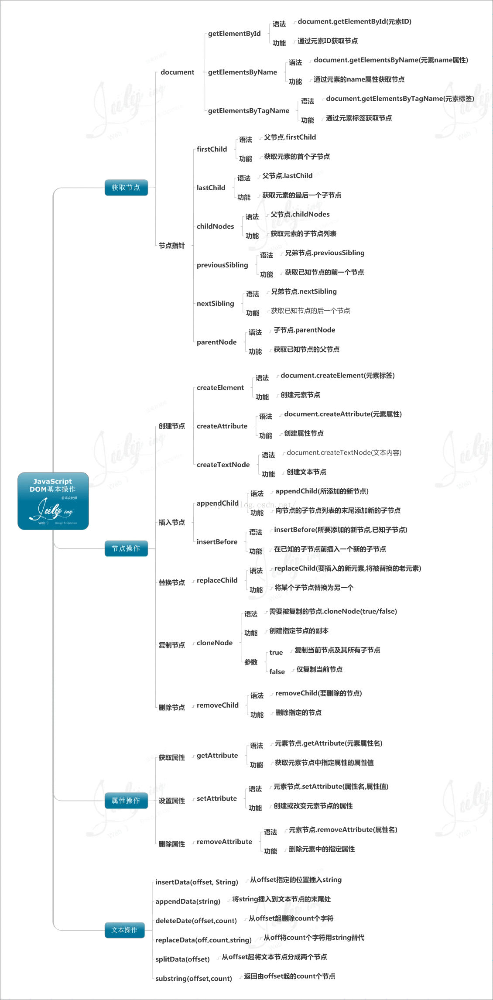

    优化dom操作的性能：
        1.对dom操作做缓存
        2.将多次dom操作合并为一次操作

### 1.9.2 Bom操作

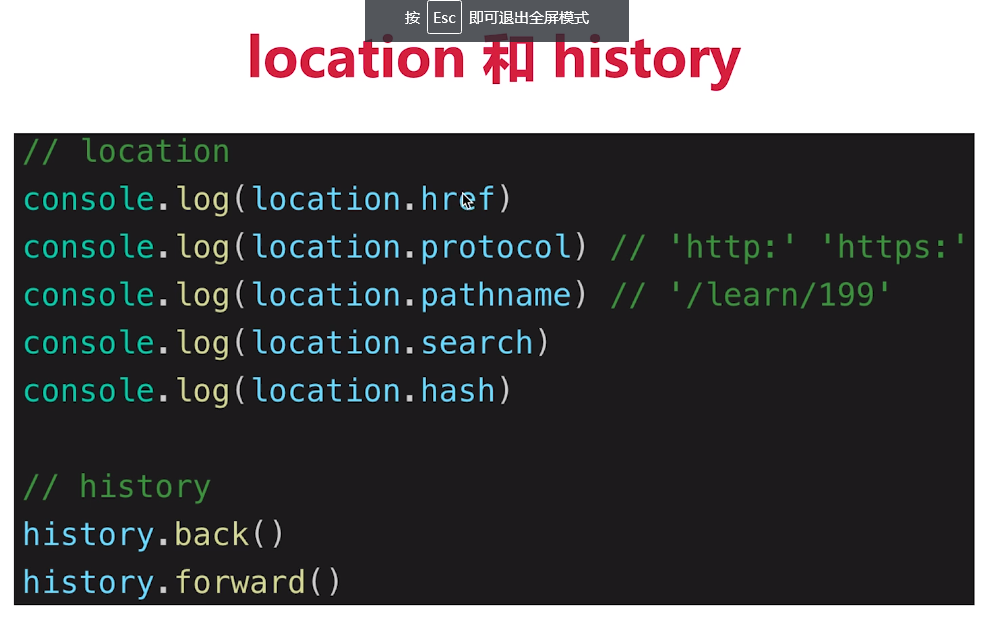

## 1.10 什么是事件委托，事件捕获，和事件冒泡
>addEventListener 的第三个参数,默认为事件冒泡，true为捕获阶段触发，false为冒泡阶段触发

    注意：冒泡和捕获最顶端是window
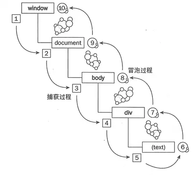   

## 1.10 浏览器储存（cookies,sessionStorage,localStorage）的区别：
    cookie：
        1.cookie本身是用于浏览器和服务器通讯使用。
        2.cookie是被借用来做本地存储的。
        3.存储空间太小，只有4KB。
        4.可以跨页面访问，存在时长可以设置。
        5.存储的数据每次都会随着http请求发送到server端。

    sessionStorage和localStorage:
        1.存储空间较大，最多每个域名可存储5MB.
        2.sessionStore随着当前浏览器的关闭而销毁。
        localStore可跨页面存在，除非主动删除一般都存在。
        3.都使用getItem和setItem 的api 进行操作。    
****

# 二：html/css：
## 2.1 子盒子在父盒子中水平居中的方法有哪几种：
    方案一：
    #father{
        position:relatuve;
    }
    #son{
        position:absolute;
        left:0;
        right:0;
        top:0;
        bottom:0;
        margin:auto;
    }
    方案二：
    #father{
        position:relatuve;
    }
    #son{
        position:absolute;
        left:50%;
        top:50%;
        transform:translate(-50%,-50%);
    }
    方案三：
    #father{
        display:flex;
        justify-content:center;
        aglin-item:center;
    }
    
## 2.2 清除浮动的几种方法(父盒子高度塌陷)：
    1.触发bfc，例如给父盒子加上一个overflow:hidden.
    2.给子盒子最后再加上一个元素，给这个子元素设置clear:both。
    3.当不方便在浮动元素后加盒子时，我们可以给父元素加一个伪元素，给伪元素设置clear:both.
## 2.3 css选择器的权重：
    !important
    内联样式（1000）
    ID选择器（0100）
    类选择器/属性选择器/伪类选择器（0010）
    元素选择器/关系选择器/伪元素选择器（0001）
    通配符选择器（0000）
## 2.4 行内块元素之间空隙出现的原因以及解决方法：
    原因：行内块元素之间出现的空白间隙，通常是由连续多个空白符（空格，换行符，回车符等）引起的。
    解决方法：给他的父元素加：font-size:0px;
## 2.5 h5新增的标签有哪些？为什么要加强标签语义化：
    新增标签：<header><footer><article><aside><time>等

    标签语义化原因：
        1.使在没有CSS样式的条件下，也能很好地呈现出内容结构、代码结构；
        2.语义化HTML会使HTML结构变的清晰，有利于维护代码和添加样式；
        3.方便其他设备解析（如屏幕阅读器、盲人阅读器、移动设备）以意义的方式来渲染网页；
        4.提升搜索引擎优化(SEO)的效果。和搜索引擎建立良好沟通，有助于爬虫抓取更多的有效信息：爬虫依赖于标签来确定上下文和各个关键字的权重；
        5.便于团队开发和维护，语义化更具可读性，是下一步吧网页的重要动向，遵循W3C标准的团队都遵循这个标准，可以减少差异化。

## 2.6 html第一行！doctype是做什么用的：
    DOCTYPE是document type(文档类型)的简写，在web设计中用来声明文档类型。在所有 HTML 文档中规定 DOCTYPE 是非常重要的，这样浏览器就能了解预期的文档类型， 告诉浏览器要通过哪一种规范（DTD）解析文档（比如HTML或XHTML规范）。 
## 2.7 搜索引擎优化（seo）：
## 2.8 伪类和伪元素的区别：
    区别：伪类的操作对象是文档树中已有的元素。比如说，当用户悬停在指定的元素时，我们可以通过:hover来描述这个元素的状态。而伪元素则创建了一个文档树外的元素。因此，伪类与伪元素的区别在于：有没有创建一个文档树之外的元素。
## 2.9 布局当中左侧固定，右侧自适应有哪几种方法：
    dom结构：
    <div class="box">
        <div class="box-left"></div>
        <div class="box-right"></div>
    </div>

    利用float + margin实现：
    .box {
        height: 200px;
    }

    .box > div {
         height: 100%;
    }

    .box-left {
        width: 200px;
        float: left;
        background-color: blue;
    }

    .box-right {
        margin-left: 200px;
        background-color: red;
    }
    
    利用calc计算宽度：
    .box {
        height: 200px;
    }

    .box > div {
        height: 100%;
    }

    .box-left {
        width: 200px;
        float: left;
        background-color: blue;
    }

    .box-right {
        width: calc(100% - 200px);
        float: right;
        background-color: red;
    }

## 2.10 rem和em
    rem:是相对于html根元素的fontsize来确定自身的大小。
    em:是相对于父元素的fontsize来确定自身的大小。
## 2.11 什么是bfc?如何触发bfc：
>定义：BFC就是一个作用范围。可以把它理解成是一个独立的容器，并且这个容器的里box的布局，与这个容器外的毫不相干

    如何触发bfc:
        1.float不为none.
        2.overflow的值不为visible.
        3.display的值为table-cell, table-caption, inline-block中的任何一个.
        4.position的值不为relative和static.

    触发bfc的用途：
        1.解决两个相邻的盒子外边距重合。
        2.解决浮动后父元素高度消失。
        3.解决两栏布局中，一栏宽度固定，另一栏随屏幕宽度自动变化。

链接阅读：
    [什么是BFC?](https://juejin.im/post/5a4dbe026fb9a0452207ebe6)
## 2.12 1像素边框是什么：

## 2.13 使用css绘制三角形：
    关键点：盒模型的边框实际上是由三角形构成。
    div {
            width: 0; 
            height: 0;
            border-width: 0 40px 40px; 
            border-style: solid;
            border-color: transparent transparent red;
        } 
链接阅读：

[CSS绘制三角形—border法](https://www.jianshu.com/p/9a463d50e441)
## 2.14 ie的盒模型和标准盒模型的区别：
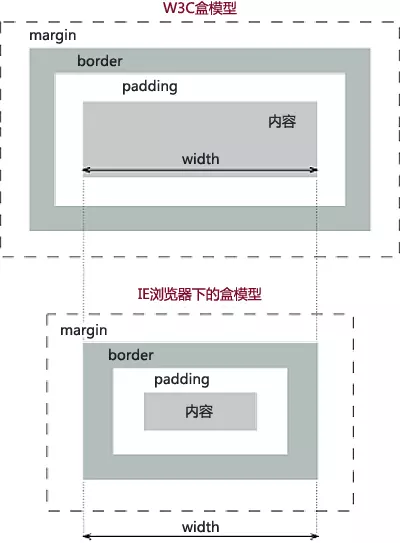

    区别：两者的区别在于content的不同，IE盒模型的content包括border、padding
    注意：1.当box-sizing使用content-box时：页面将采用标准模式来解析计算，content-box也是默认模式
    2.当当box-sizing使用border-box时，页面将采用怪异模式解析计算，怪异模式也称为IE模式

## 2.15 元素的层叠登记：
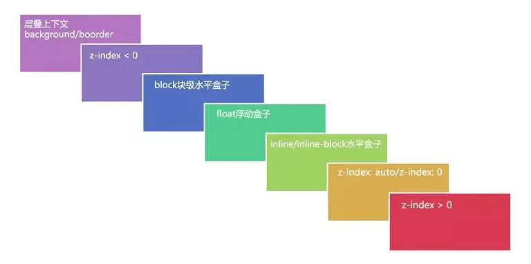

## 2.16 当有两个层叠的盒子当都有点击事件时如何只触发父盒子的事件？

## 2.17 随着浏览器窗口变化自适应的正方形
    一：利用新增单位Vw:
```
#square{  
    width:30%;  
    height:30vw;  
    background:red;  
} 
```
    二：利用padding-bottom撑开：由于margin, padding 的百分比数值是相对父元素的宽度计算的，只需将元素垂直方向的一个padding值设定为与width相同的百分比就可以制作出自适应正方形了。

但要注意，仅仅设置padding-bottom是不够的，若向容器添加内容，内容会占据一定高度，为了解决这个问题，需要设置height: 0。

```
#square{  
    width:30%;  
    height:0;  
    padding-bottom: 30%;  
    background:red;  
} 
```

# 三：js：
## 3.1数据类型
### 3.1.1 js的数据类型有哪些,什么是基本数据类型，和引用数据类型？
    数据类型：
        es5: Number(数字类型)，String（字符串类型），Boolean(布尔类型)，Null(空对象)，Undefined(没有定义),Object(对象)
        es6:Symbol(唯一值)
    基本数据类型：
        包含：Number(数字类型)，String（字符串类型），Boolean(布尔类型)，Null(空对象)，Undefined(没有定义)，es6:Symbol(唯一值)
        特点：储存在栈内存中，值不可修改。
    复杂数据类型：
        包含：Object(对象)。
        特点：地址储存在栈内存中，值储存在堆内存中，堆内存中的值可修改。

链接阅读：
    [[译]助力年后跳槽涨薪，深入理解 JavaScript 内存模型](https://juejin.im/post/5e398ddaf265da57455b310d)

### 3.1.2 数据类型判断有哪几种方法，每种方法有什么优缺点：
    typeof:
        简介：一元运算符，可直接写在操作数前面。如：typeof 'a',也可以采用函数的形式typeof('a');
        优点：可以用来检测基本数据类型,返回的值："number","boolean","string","undefind,"symbol"。
        缺点：引用类型检测不了。返回的值:"function","object"。

    instanceof：
        > 简介：  instanceof 是通过原型链判断的，A instanceof B, 在A的原型链中层层查找，是否有原型等于B.prototype，如果一直找到A的原型链的顶端null,仍然不等于B.prototype，那么返回false，否则返回true.
        优点：对于是使用new声明的类型，可以很好的检测出来，它还可以检测出多层继承关系。
        缺点：instanceof不能区别undefined和null，而且对于基本类型如果不是用new声明的则也测试不出来

    Object.prototype.toString.call()：
        简介：在任何值上调用 Object 原生的 toString() 方法，都会返回一个 [object NativeConstructorName] 格式的字符串。每个类在内部都有一个 [[Class]] 属性，这个属性中就指定了上述字符串中的构造函数名。
        优点：可以很好的检测内置的基本数据类型，以及内置的复杂数据类型。
        缺点：不能检测非原生构造函数的函数名。
链接阅读：

[JavaScript专题之类型判断(上)](https://segmentfault.com/a/1190000009943534)

[JavaScript专题之类型判断(下)](https://segmentfault.com/a/1190000010054116)

[js判断数据类型](https://segmentfault.com/a/1190000015264821?utm_source=channel-hottest)
### 3.1.3 数据类型转换
    

链接阅读:

[深入理解JavaScript数据类型转换](https://juejin.im/post/5c4edc1ef265da6144206911)

### 3.1.4 数据运算：
    
## 3.2 数组
### 3.2.1 数组操作的常用方法（必须熟记）：
    会改变原数组的方法：
        1.arr.pop() //pop()把Array的最后一个元素删除掉,返回值为被删掉的元素。
        2.arr.push(5,6) // push()向Array的末尾添加若干元素，返回值是数组的长度。
        3.a.unshift(-1,0) // 做用为往Array的头部添加若干元素，返回数组的长度
        4.arr.shift() //shift()方法则把Array的第一个元素删掉[0,1,2,3,4,5,6]，返回被删掉的元素。
        5.arr.splice(index,number,item) //剪接方法，删除数组指定位置的几个数据，此方法会改变原数组，返回删去的元素所组成的数组。
        6.arr.reverse() //会反转数组，并返回原数组。
    不会改变原数组的方法：
        1.Array.isArray(arr)//判断一个变量是数组还是伪数组,是数组返回true,否则返回flase
        2.arr.indexOf(6) // -1 在数组中寻找是否存在传入的参数，不存在返回-1，存在返回索引值。
        3.arr.concat(['a','b']) //concat()方法把当前的Array和另一个Array连接起来，并返回一个新的Array：[1,2,3,4,5,'a','b'] （此方法不改变原数组，返回一个新数组）。
        4.arr.slice(0, 3); // 切片方法，从索引0开始，到索引3结束，但不包括索引3: [1, 2, 3]。 （此方法不改变原数组，返回一个新数组）
        5.arr.sort() //sort()可以对当前Array进行排序，它会直接修改当前Array的元素位置，直接调用时，按照默认顺序排序：
        6.arr.join() //将数组根据传入字符转化成字符串。
        7.arr.map((item)=>{}) //高阶函数，遍历数组，处理原数组的每个子项，拼成一个新数组返回。不修改原数组。
        8.arr.filter((item)=>{}) //高阶函数，遍历数组找出符合条件的额子项，租成新数组返回，不修改原数组。

链接阅读：

[数组-廖雪峰的官方博客](https://www.liaoxuefeng.com/wiki/1022910821149312/1023020967732032)

## 3.3 字符串
### 3.3.1 字符串操作的常用方法(必须熟记)：
    注意：因为字符串类型是储存在栈中的，因此所有方法都不会改变原字符串。
        1.split //根据传入参数将字符串转化为数组。并返回生成的数组。此方法是数组join()的逆操作。
        3.substr //更据传入的起始下标和结束下标切割字符串并返回，不改变原字符，类似于数组的slice方法。
        4.toUpperCase //将字符转化为大写字母并返回。不改变原字符。
        5.toLowwerCase //将字符转化为小写字符并返回。不改变原字符。
        6.indexOf //查找字符串中指定字符，找到了返回下标，没找到返回-1。
        2.charAt //根据字符下标查找字符并返回。是indexOf函数的逆操作。

## 3.4 作用域，自由变量，闭包
    
### 3.4.1 什么是作用域？什么是作用域链？

链接阅读：

[]()
### 3.4.2 什么是词法作用域，什么是动态作用域：
    词法作用域：
        函数的作用域在函数定义的时候就决定了。
    动态作用域：
        函数的作用域是在函数调用的时候才决定的。

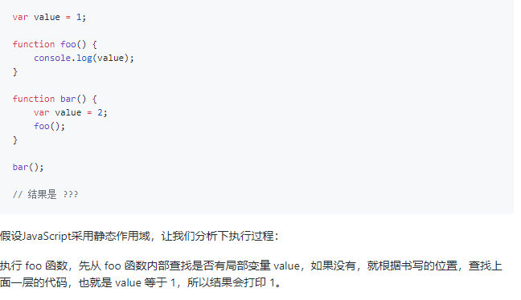      
链接阅读:

[JavaScript深入之词法作用域和动态作用域](https://segmentfault.com/a/1190000008972987)

### 3.4.3 闭包是什么？闭包的优缺点：
>闭包：能够访问自由变量的函数（从这个角度来讲，所有函数都是闭包）。

    应用：防抖，节流，循环注册事件等。
    优点：
    缺点：引起内存泄露。

### 3.4.4 js有哪几种情况会导致内存泄露，内存泄露后如何处理：
> 内存泄露：不再用到的内存，没有及时释放，就叫做内存泄漏。
    
    导致内存泄露的情况：
        1.当页面中元素被移除或替换时，若元素绑定的事件仍没被移除，在IE中不会作出恰当处理，此时要先手工移除事件，不然会存在内存泄露。
        2.闭包

## 3.5 面向对象
### 3.5.1.生成对象有哪几种方法：
    1.使用Object
    2.使用工厂函数批量生产
    3.使用构造函数
    4.使用字面量的形式生成
链接阅读：

[JavaScript深入之创建对象的多种方式以及优缺点](https://segmentfault.com/a/1190000009359984)

### 3.5.2 执行new关键字时做了哪些操作：
    1.在内存中新创建一个对象。
    2.将this指向这个对象。
    3.将函数执行一遍。
    4.将这个对象返回。
### 3.5.3 函数中this的指向,改变this指向有哪几种方法：
    基本原则：指向最后调用他的那个对象。
        例：Obj.fn() this指向Obj
    注：若函数前无明显对象，则由全局对象window调用。
### 3.5.4 call/apply/bind之间的区别，如何手动实现一个bind:
>call() 方法在使用一个指定的 this 值和若干个指定的参数值的前提下调用某个函数或方法。

>apply()方法在使用一个指定的this值和数组或类数组的作为参数值得前提下调用某个函数或方法。

>bind()方法指定this值，但是不调用方法。

链接阅读：

[this、apply、call、bind](https://juejin.im/post/59bfe84351882531b730bac2)

[JavaScript深入之call和apply的模拟实现](https://juejin.im/post/5907eb99570c3500582ca23c)

[JavaScript深入之bind的模拟实现](https://juejin.im/post/59093b1fa0bb9f006517b906)

### 3.5.5 原型，原型链是什么：
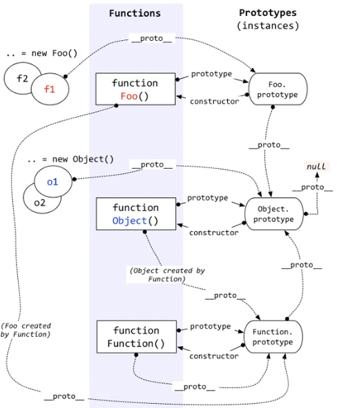

    原型：用于托管公共方法与公共属性的对象。

    原型链：将多个原型之间关连起来组成一套属性或方法查找的规则叫做原型链。
链接阅读：

[【重点】图解：告诉面试官什么是 JS 原型和原型链?](https://juejin.im/post/5db0fec4518825648c3a8770)

[JavaScirpt深入之从原型到原型链](https://segmentfault.com/a/1190000008959943)

### 3.5.6 继承的几种方法和各自的优缺点，es6中class继承的原理：
    es6:继承使用extends

链接阅读：
    
[阮一峰es6继承](https://es6.ruanyifeng.com/#docs/class-extends)

### 3.5.7 js的多继承如何实现？
### 3.5.8 对象有哪些遍历方法：
### 3.5.9 for in和 for of 的区别：
    
## 3.6 es6新特性
### 3.6.1 es6有哪些新特性？let,const,var之间有什么区别：
    新特性：
        1.let ,const
        2.模版字符串
        3.promise
        4.箭头函数
        5.Symbol（唯一值）
        6.Set 和 Map
        7.Async
        8.class
        9.解构赋值
    let,const,var之间有什么区别：
        1.let,和const引入块级作用域。
        2.var存在变量提升,let,const不存在变量提升。
        3.同一作用域下let和const不能声明同名变量，而var可以。
        4.暂时性死区：在代码块内，使用let声明变量之前，该变量都是不可以使用用。
        5.不绑定全局作用域。


链接阅读：

[ES6 完全使用手册](https://segmentfault.com/a/1190000017171866)

[ECMAScript 6 入门](http://es6.ruanyifeng.com/#docs/let)

[ES6 系列之 let 和 const](https://segmentfault.com/a/1190000014951691)

### 3.6.2 解释promise,和ansy,await，generator：


链接阅读：

[八段代码彻底掌握 Promise](https://juejin.im/post/597724c26fb9a06bb75260e8)
### 3.6.3 解释map和set:
    map：
        出现：
            JavaScript的对象有个小问题，就是键必须是字符串。但实际上Number或者其他数据类型作为键也是非常合理的。为了解决这个问题，最新的ES6规范引入了新的数据类型Map------by廖雪峰的官方博客。
        使用：
            初始化Map需要一个二维数组，或者直接初始化一个空Map。如：
                let  a = new Map([['tom',88],['lily',89],['jay',99]]); //声明一个map类型的变量。 
            Map具有以下方法：
                let b = new Map();
                b.set('jay',100) // {"jay" => 100} (增加)
                b.set('jay',99) // {"jay" => 99} (修改)
                b.get('jay') // 100 (查询)
                b.has('jay') //true (查询)
                b.delete('jay) //true (删除)

    set:
        作用：
            Set和Map类似，也是一组key的集合，但不存储value。由于key不能重复，所以，在Set中，没有重复的key。
        使用：
            要创建一个Set，需要提供一个Array作为输入，或者直接创建一个空Set：
                let a = new Set(); // {}
                let b = new Set([1,2,3,'3',4,4]); //{1,2,3,'3',4}
            set具有以下方法：  
                b.add(5) // {1,2,3,'3',4,5} (增加)
                b.delete(5) //{1,2,3,'3',4} (删除)

        注：此特性可被用于数组去重。

链接阅读

[Map和Set](https://www.liaoxuefeng.com/wiki/1022910821149312/1023024181109440)

****

# 四：Vue：

## 4.1.vue基础
### 4.1.1.vue的生命周期有哪些，他们之间的作用，在有父子组件的情况下又是怎样的：
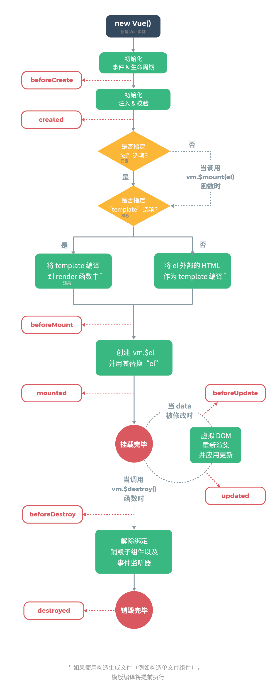
    在有父子组件的情况下的生命周期：
        (创建渲染过程)
        父beforeCreate->父created->父beforeMount->子beforeCreate->子created->子beforeMount->子mounted->父mounted
        (更新过程)
        父beforeUpdate->子beforeUpdate->子updated->父updated
        (销毁过程)
        父beforeDestroy->子beforeDestroy->子destroyed->父destroyed

链接阅读：
[彻底搞定vue2.0生命周期钩子函数问题](https://juejin.im/post/5e566c646fb9a07c951cda78)

### 4.1.2.页面第一次加载可以会触发哪些生命周期函数？
    第一次页面加载时会触发 beforeCreate, created, beforeMount, mounted 这几个钩子

### 4.1.3.computed和watch的区别，以及他们的应用场景：
    区别：computed有缓存，data中的数据不发生变化则不会重新计算。watch相当于数据变化之后触发的回调。
    注意：watch默认浅监听，computed也是浅监听。
    watch如何进行深度监听：
        浅监听：意为无法监听引用数据类型
        深监听：意为可以监听引用数据类型，但是无法正常记录oldVal,和val
        watch默认为浅监听,想要深度监听需在监听属性中设置deep为true

### 4.1.4.v-if和v-show的区别：
    区别：v-if会根据初始条件的不同判断是否需要渲染dom节点。频繁切换，性能消耗大，适用于不经常显示隐藏的节点。
          v-show无论初始条件是什么都将会渲染节点，但是会根据条件的不同，动态地切换display属性来显示隐藏节点。
          适用于需要频繁显示隐藏的节点。

### 4.1.5.vue中父子组件和兄弟组件的传值方式：
    父传子：
        使用props
    子传父：
        使用this.$emit(name,val)来触发父组件中的自定义方法，并传值
    兄弟组件间：
        1.使用vuex
        2.自定义事件：新创建一个Vue的实例，如：var event=new Vue(),使用实例中的event.$emit(name,val),绑定自定义方法并传值
        在另一个组件中使用event.$on(name,func)触发方法并在方法中获取传过来的值。

### 4.1.6.如何获取dom节点
```
//标记dom节点
<div ref='flag'></div>
//获取dom节点
new Vue({
    //...
    methods:{
    foo:function(){
        var div = this.$refs.flag;
    }
}
})
```
### 4.1.7.为何组件中的data必须是一个函数：
>注意：构造函数原型对象中的属性不为所有实例共享，即实例A去原型中寻找到组件的属性和方法后，将属性拷贝了一份到实例中，因为值传递和引用传递的关系，引用类型的属性指向的是一个地址，所以B组件也共享此属性。

    组件最大的一个功能则是能复用，每个组件则是组件构造器的一个实例，
    data属性是放在组件构造器的原型上的，再加上是一个引用类型，因此被所有的组件所共享，data是一个方法以后，其中的return 会重新开辟一块儿内存，维护组件自有的data

## 4.2vue高阶 
### 4.2.1.在自定义组件当中使用v-model：
```
<input v-model="value" />
// 就是相当于: 
<input :value="value" @input="value= $event.target.value" />
```
    本质：v-model实际上是v-on和v-bind的语法糖，本质上是运用了自定义事件。

链接阅读：

[vue在自定义组件中使用v-model及v-model的本质](https://www.jianshu.com/p/50ddd91dcbbc)

### 4.2.2.$nextTick 的作用：
    作用： 因为vue是一个异步渲染框架，即data改变后，dom不会立刻被渲染，若想在dom渲染完成之后
    拿到dom节点，则需要使用:
```
methods:{
    foo:function(){
        this.$nextTick({()=>{
        //在回调函数中获取更新完的dom
    }})
    }
}
```
链接阅读：

[【Vue原理】NextTick - 白话版](https://juejin.im/post/5ae3f0956fb9a07ac90cf43e)

### 4.2.3.插槽solt有什么作用：
    具名插槽：有名字的插槽，在在子组件中使用<slot name='solt-name'></slot>，
    在需要传递的内容上加上slot='solt-name'，即可将内容准确地填入插槽中。
    匿名插槽：没有名字的插槽
    作用域插槽：向父组件传递子组件数据的插槽。父组件的传入的dom结构需用<template></template>
    标签包裹，其作用使其在父组件中可以自定义子组件的表现方式

链接阅读：

[vue作用域插槽，你真的懂了吗？](https://www.jianshu.com/p/e10baeff888d)

[关于作用域插槽的理解](https://segmentfault.com/a/1190000015938629)

### 4.2.4.keep-alive有什么作用：
    作用：用来缓存组件，例如来回切换的tab标签页，常常需要缓存组件，来节约性能。使用<keep-alive></keep-alive>
    包裹组件就能打到组件缓存的效果。
### 4.2.5.动态组件：
```
    //不指定具体的组件，根据componentName的不同动态地切换组件
    <component :is='componentName'></component>

```
### 4.2.6.异步组件：
    介绍：若有一个非常大的组件，同步引入时非常耗时，可使用异步加载的方式，什么时候用到
    什么时候加载组件，使用如下：
    new Vue({
        //...
        component:{
            componentName:()=>import('./my-async-component')
        }
    })

### 4.2.7.mixin:
    作用：抽离各个组件相同的逻辑，使用如下：
```
import myMixin from './mixin'
new Vue({
    //...
    mixins:[mymixin]
})
```
## 4.3 vue插件
### 4.3.1.vue-router的原理：
### 4.3.2.vue-router 的钩子函数有哪些？那个是可以全局使用的钩子函数？
### 4.3.3.vue-router 的hash,和history两种模式？
    相同点：
    不同点：
### 4.3.4.$router和$route有什么区别？
### 4.3.5.axios拦截器的使用：
### 4.3.6.axios拦截器：
### 4.3.7.axios底层是如何实现的：
### 4.3.8.vuex的原理及使用：
    一：vuex概念：
    1.state:
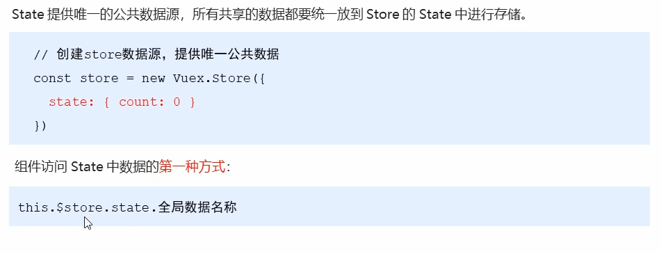 
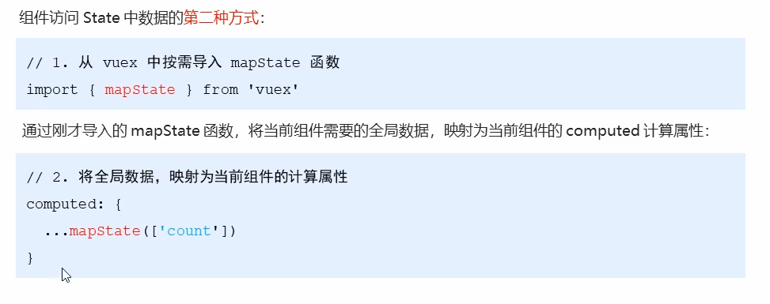    
    2.mutation
    3.action

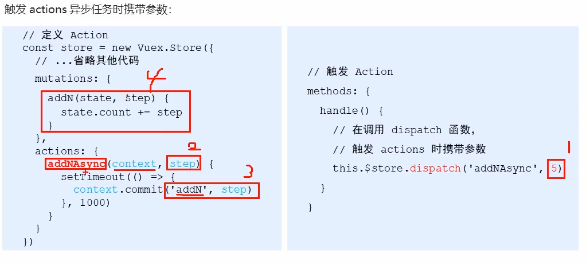
    4.getters:类似于vue计算属性的功能
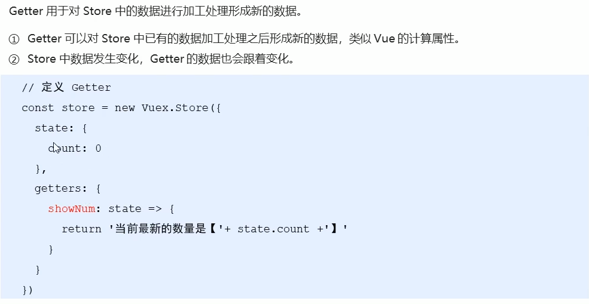
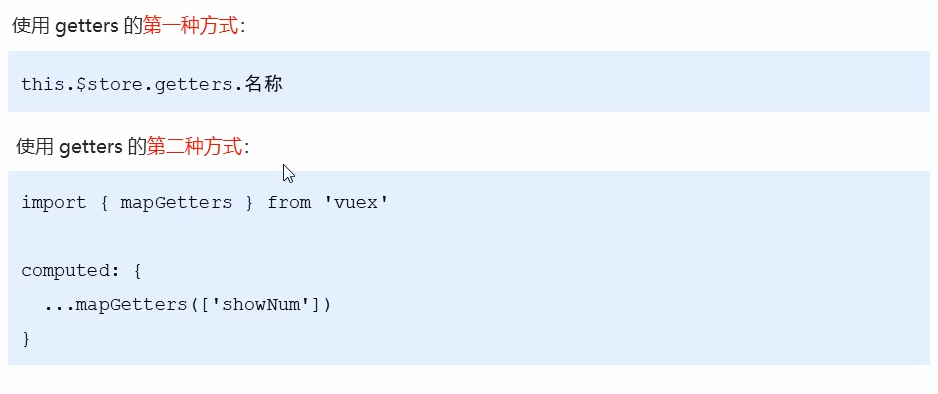

    二：vuex用于组件中的概念：
    1.dispatch
    2.commit
    3.mapState
    4.mapMutation
    5.mapAction
    6.mapGetters

## 4.4 vue原理
### 4.4.1.vue响应式原理：
    原理：使用Object.defineproperty()函数进行监听data属性，当data中的数据发生变化时会触发set,和get回调函数，从而实现根据数据变化而实现dom操作。
    要点：
        1、Object.defineProperty  -  get ，用于 依赖收集
        2、Object.defineProperty  -  set，用于 依赖更新
        3、每个 data 声明的属性，都拥有一个的专属依赖收集器 subs
        4、依赖收集器 subs 保存的依赖是 watcher
        5、watcher 可用于 进行视图更新
    
    缺点：
        1.若data数据中有引用数据类型时，要无限递归地去监听对象属性，成本较大。
        2.无法监听data是否新增或者删除属性。如若需要监听data中新增或者删除的属性，需要使用Vue.set(),和Vue.delete()
        3.无法监听data中的数组属性

链接阅读：

[【Vue原理】响应式原理 - 白话版](https://juejin.im/post/5c21a306e51d4526262966c3)

### 4.4.2 什么是虚拟dom:
    介绍：用js来模拟dom的结构
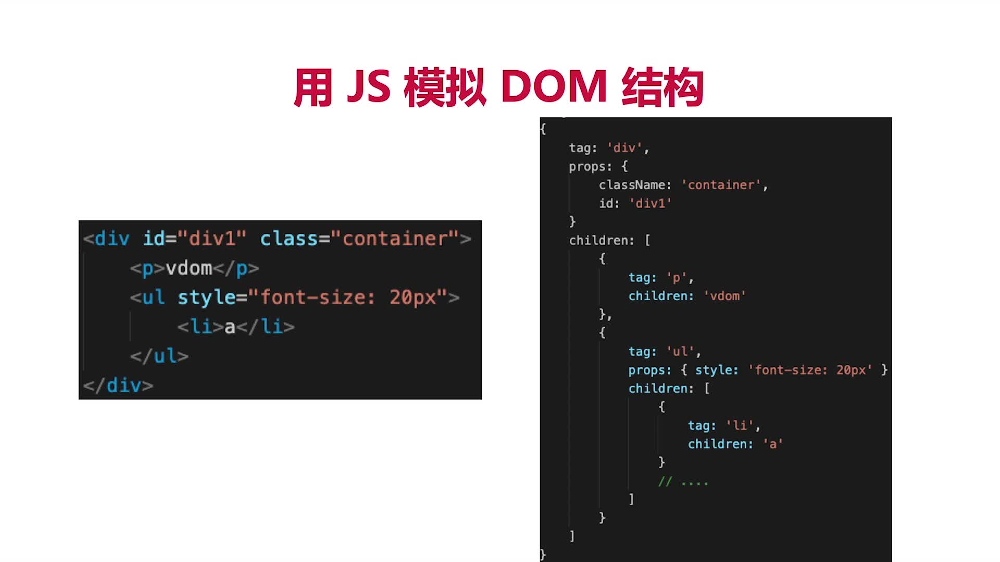
### 4.4.3 diff算法是什么？如何比较：
    diff算法是vue框架中比较两个vdom异同点的方法，其比较方式如下：
    1.只在同一层级进行节点的比较，不跨级比较
    2.tag不相同，则直接删掉重建，不再深度比较
    3.tag和key，两者都相同，则认为是相同节点，不再深度比较

链接阅读：

[【Vue原理】Diff - 白话版](https://juejin.im/post/5d75afec6fb9a06aeb10e354)

### 4.4.4 模版渲染：
    
### 4.4.5 描述组件渲染和更新的过程：


    1.初次渲染：


    1.组件更新过程：


链接阅读：

[【Vue原理】Compile - 白话版](https://juejin.im/post/5d4cec74e51d4561bb33fb0d)


### 4.4.6 v-if和v-for为何不应该连用：
    原因：因为v-for的优先级大于v-if则每次渲染列表时都将遍历整个列表，性能上有损耗，因此当有业务需求时，应使用计算属性先将不需要渲染的数据过滤。

链接阅读：

[Vue：v-for 与 v-if 的优先级，以及避免同时使用](https://juejin.im/post/5d3d745851882556d1684b16)

### 4.4.7 v-for渲染列表时key值的作用：
    在diff算法比较v-node时，会比较vnode的tag和key判断是否是同一dom节点，如果是同一节点才会进行下一节点的比较。如果没有key则会增加diff算法比较成本。
### 4.4.8 vue常见性能优化：
    1.合理使用v-show和v-if.
    2.合理使用cumputed,因为computed有缓存。
    3.v-if和v-for不可同时使用，需要给循环的每一项加上业务的key值
    4.图片懒加载，路由懒加载
    5.自定义事件和dom事件要在beforedestory中及时销毁
    6.合理使用<keep-alive />
    7. data层级不要太深
    8.webpack层级的优化。

****

# 五：react
## 1.react组件如何通信：
    1.子传父使用传递事件的形式，在子组件触发父组件中的方法。
    2.父传子使用props。
    3.自定义事件的形式。
    4.redux和context
## 2.react jsx的本质是什么：

## 3.context 是什么有何作用：
    作用：父组件向所有的子孙组件传递数据。
    应用：比如传递语言，主题色之类的数据。

## 4.SCU的用途：
    1.性能优化，在react组件中，当父组件变化时，无论子组件的props有无变化都将被重新渲染。
    因而可以在scu中判断props有无变化，控制组件是否渲染。
    2.需要配合不可变值一起使用不然可能出错。
## 5.描述redux 的单向数据流：
    使用流程：
        1.下载redux,
        2.创建store文件夹，在里面创建index.js文件，在文件中从redux中引入createStore,使用createStore创建一个Store.
        3.在store文件夹下创建一个reduser,reducer函数接受两个参数，一个是defaultState，另一个是action.
        4.在index.js中引入reducer,传给创建出的store.
        5.在组件引入store,通过store.getState()方法拿到store中的数据。

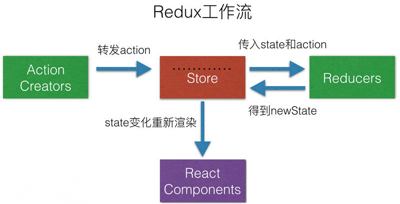
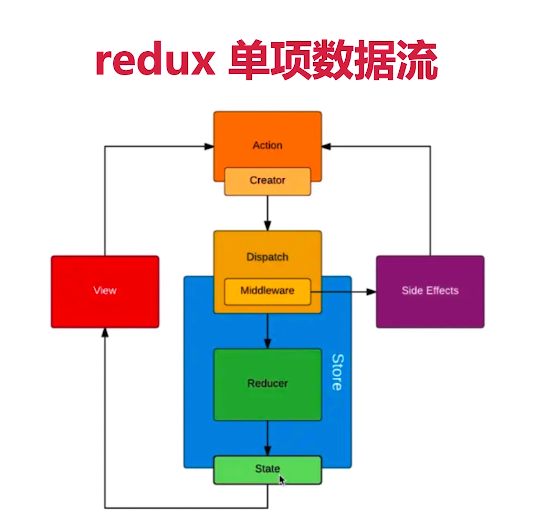
## 6.setstate的特性：
    特性：
        1.不可变值。
        2.可能是异步的。
            在setTimeOut中使用this.setState()
            this.setState()的第二个参数，是一个回调函数，在函数中可以拿到刚刚更新过的值。
        3.可能会合并

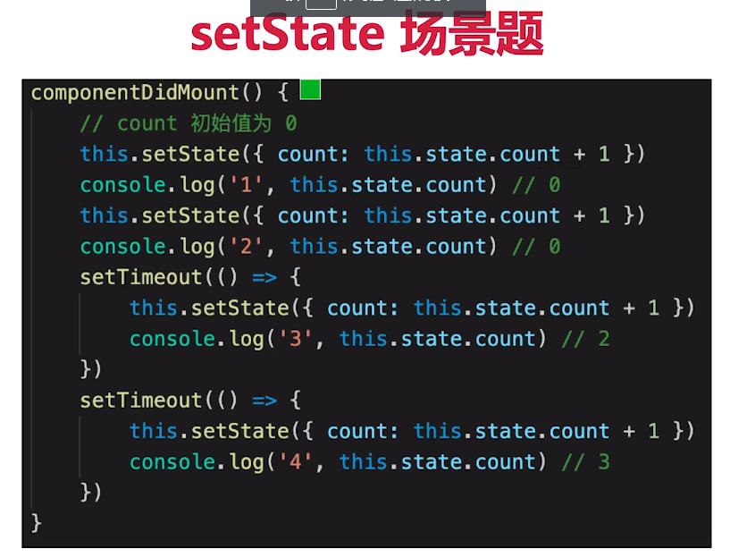

## 6.什么是纯函数，什么是不可变值：
    纯函数：返回一个新值，且没有副作用（不会改变其它值本身）。
    不可变值：
## 7.单组件的生命周期是怎么样的？有父子组件时又是怎么样的？
    注意：
    1.当组件第一次被渲染时只会执行mounting中的三个函数。
    2.shouldComponentUpdate函数中若返回flase则组件不会重新渲染。


## 8. ajax的请求应该放在哪个生命周期函数中？
    放在componentDidMount里
## 9. 为什么在循环中需要使用 key?
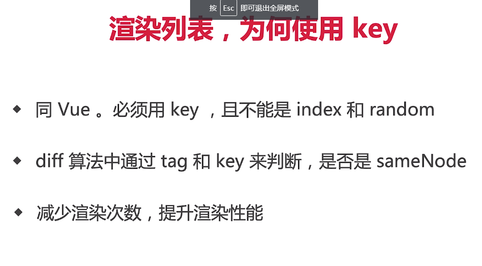

## 10.函数组件和class组件的区别？
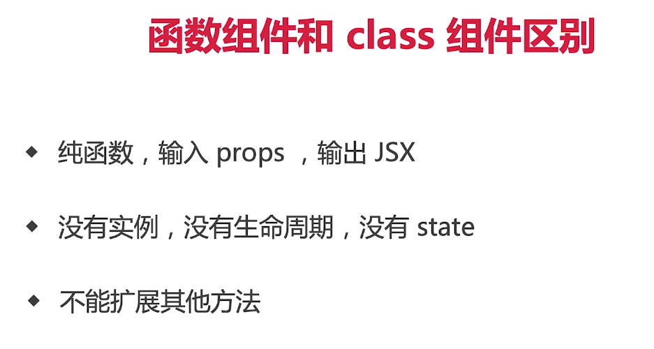

## 11.受控组件和非受控组件的区别（value和defaultValue的区别）？
    受控组件：组件中的状态被state所托管，用户操作改变State中的值，值反过来影响视图。形成了一个闭环。

    非受控组件：组件的状态没有被react所托管，用户的操作影响不到组件的状态。

    例如：react中的value属性值需要被state所托管，需要定义一个onChange的方法不然react会提示错误信息。defaultValue则类似与原生Input组件的value,不经过react，组件的状态不受控制。

## 12.多个组件中有公共逻辑，该如何抽离？


## 13.redux 如何进行异步的请求？


## 14.react-router 如何进行懒加载?
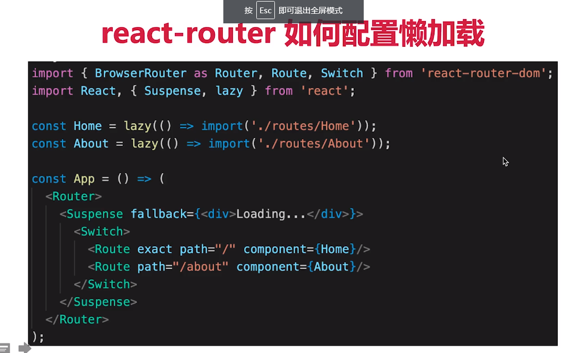

## 15.什么是纯组件?
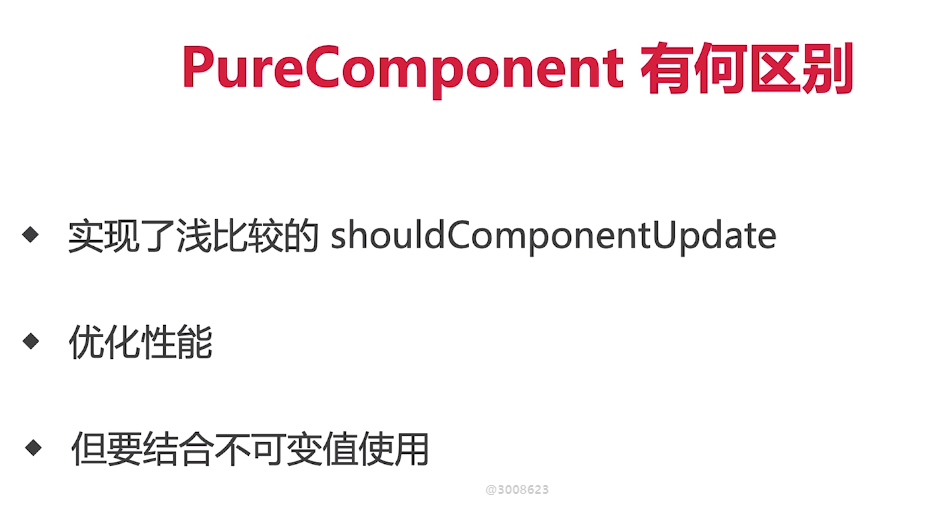

## 16.react 的事件对象和原生的事件对象有何区别？
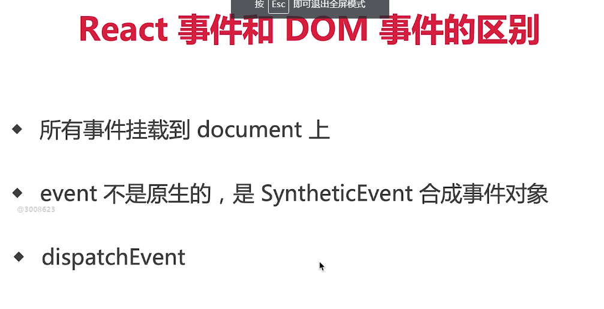

## 17.react的性能优化?
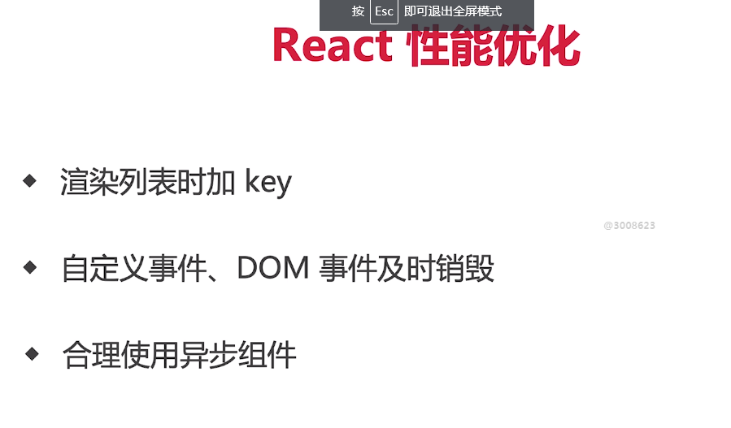
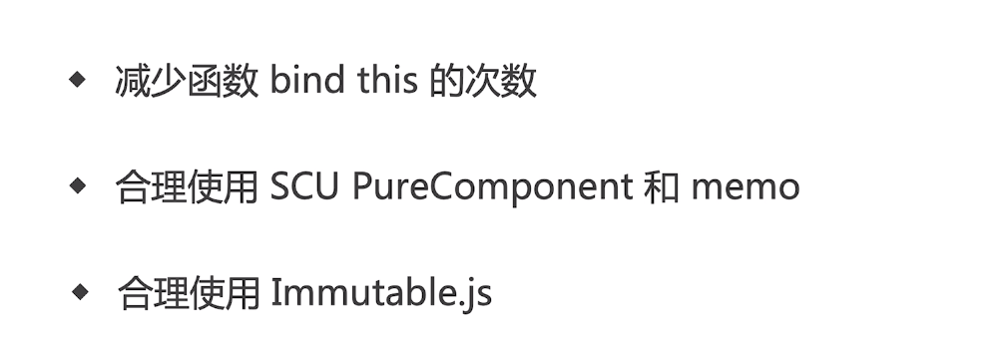
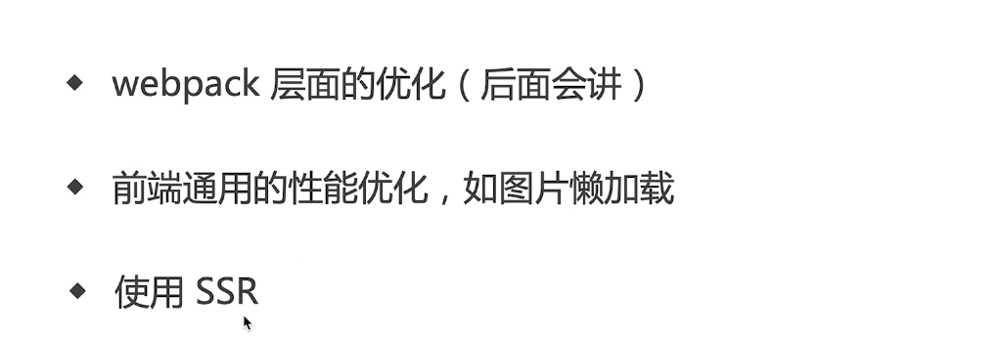

## 18.vue和react的区别？
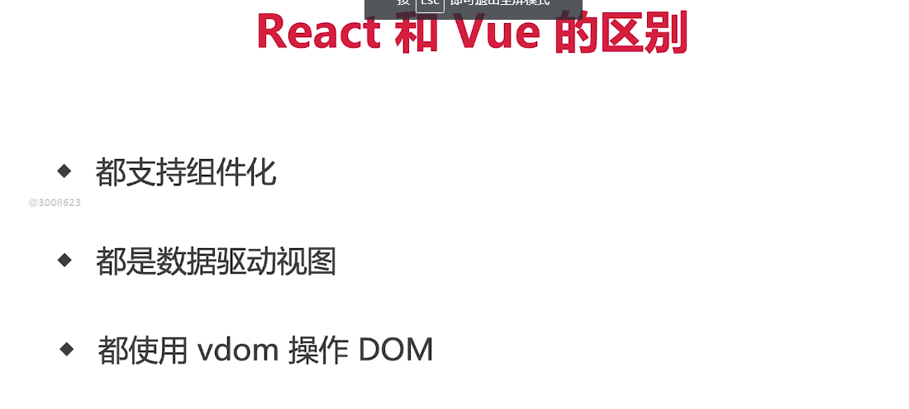
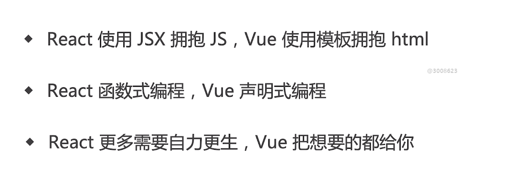

****

# 六：打包工具（webpack）:
## 6.1.前端代码为什么要构建和打包：
    1.兼容性处理，代码体积更小，代码规范
    2.高版本语言处理
    3.性能优化
## 6.2 webpack常用配置有哪些：
    一：基本配置：
        1.css,less文件打包，压缩,拆分，兼容性处理
        2.js 文件的打包，压缩，编译，拆分
        3.图片资源的打包，html文件内图片打包，小内存图片转换base64
        4.字体图标打包
        5.html开启模版
        6.vue文件,jsx文件的打包
        7.开发环境下启用dev-server
    二：高级配置
        1.多文件入口打包
        2.文件懒加载

## 6.3 moudle ,chunk,和bundle有什么作用：
    1.module:一个个源代码文件。
    2.chunk:多个module文件的集合。
    3.bundle：打包后输出的文件。
## 6.4 loader和plugin的区别：
## 6.5 webpack如何实现懒加载：
    使用import 导入一个包后返回一个promise,并单独打包一个chunk文件，在promise中去访问包的内容。
## 6.6 webpack如何实现性能优化：
    打包构建时的性能优化：
        打包构建速度：
            1.开启HMR功能：即在devServer中配置，没有修改的文件不再进行打包构建。
            2.开启balbel缓存，即没有修改过的js文件不再进行balbel编译，直接从缓存中读取，优化打包速度。
            3.ingorePlugin，忽略无用的文件
            4.公共文件的抽离，即很多文件中引入了相同的第三方模块，这样导致打包的速度变慢，体积过大，抽离第三方文件，单独打包成一个chunk即可避免。
            5.tree shaking :即引用的包才进行打包没有引入的文件不被打包。
            6.使用noParse避免重复打包，配置后的文件将不会被打包，其在module中配置。
            7.使用happyPack进行多进程打包加快打包速度。使用ParallelUglifyPlugin开启多进程压缩js代码
            8.使用dllPlugin提前打包好一些第三方不常更新的包

        开发环境下调试代码：
            1.开启source-map功能，调试过程中，会生成源代码和chunk文件的映射关系，可以很方便地找到错误的代码
    生产环境下的性能优化：
        产品的性能优化：
            1.开启缓存，即输出chunk文件时，对文件名进行，contenthash命名，这样在后台开启缓存的时候，会对相同文件名的文件命中缓存。
            2.懒加载：即当请求的文件过大时，采用文件懒加载的形式，即一次不全请求会来，当条件满足触发后加载包文件
            3.图片开启小图片转base64格式，即上线后的代码不用走网络请求
            4.提取公共代码
            5.ingorePlugin 忽略加载某些文件
            6.cdn加速
            7.使用scope Hosting：将多个函数打包为一个函数，从而减小代码体积，避免内存消耗，提高代码的可读性。
## 6.7 babel-tuntime和babel-polyfill的区别：
    babel-polyfill：因为babel只做语法层面的解析，新的api不能解析，所以需要引入babel-polyfill做新api解析。
    babel-runtime: 在babel-polyfill做api解析时会污染全局变量，且多个文件都都使用相同的新api,会导致重复加载代码，
    导致文件体积变大，babel-runtime可以解决此问题。

****

# 七：网络（http）
## 7.1 get和post的区别：
    区别：
        1.get请求所携带的数据在url上，而post方法携带的数据在请求体中。
        2.get一般用于获取数据，post用于提交数据（提交的数据体积更大）。
        3.在安全性上，post用于防止crsf攻击。因为post请求的跨域需要后端配合。

## 7.2 http请求头中的content-type有什么作用:
    作用：在原生post请求中需要设置content-type来告诉服务器客户端传入数据的格式，这样服务器端才能知道按照哪种格式来解析数据。
## 7.3 http和https之间的区别：
## 7.4 常见状态码：
## 7.5 http的三次握手和四次挥手：
## 7.6 跨域的几种方式，jsonp的原理：
    同源策略：
        由于浏览器限制，客户端通过ajax向服务端请求数据时，必须保证客户端的协议，端口和域名与服务器端一致。
        这样才能成功发送请求。
    解决方法：
        注：浏览器在加载图片，css,js时不受同源策略限制。所有的跨域都需要通过server端的配合实现。
        1.jsonp:
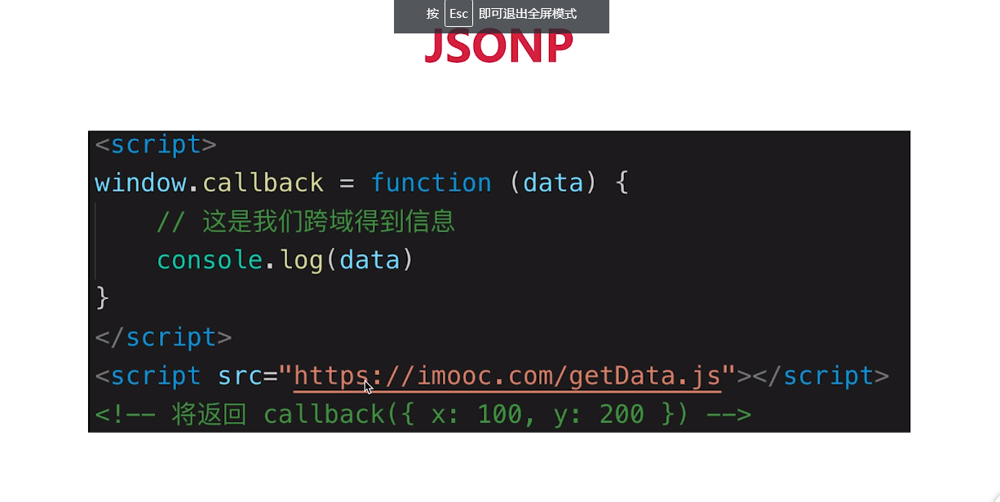

        2.cors:服务器端设置访问的权限
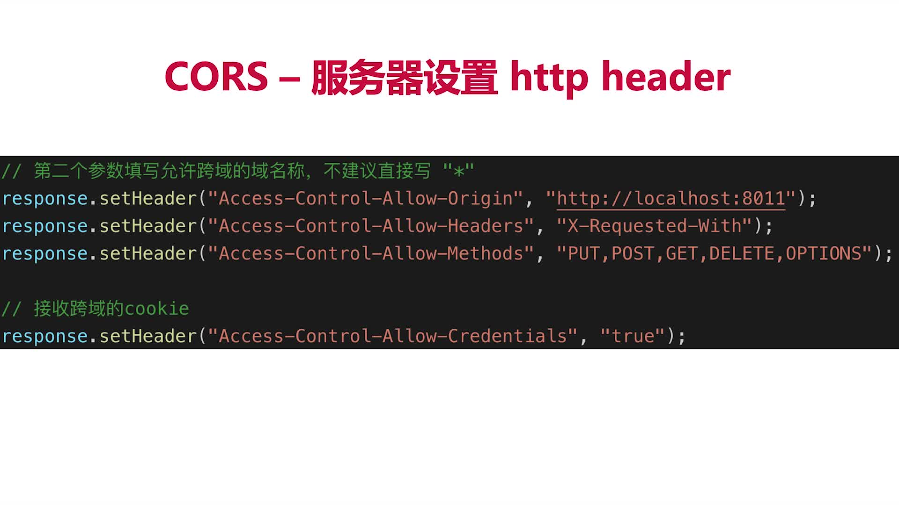


****

# 八：设计模式
## 8.1 js的设计模式有哪些：
    1.单例设计模式
    2.发布订阅者模式
    3.工厂模式

****

# 九：数据结构与算法：
 
****

# 十：业务：
## 10.1 轮播图的实现原理：

## 10.2 如何实现页面加载进度条：

****

# 十一：性能优化

链接阅读：
[浏览器缓存知识小结及应用](https://www.cnblogs.com/lyzg/p/5125934.html)

****

# 十二：前端安全
## 1.xss攻击：
    原理：在要求输入的内容中插入一个script脚本，当用户请求到资源后，脚本在用户的浏览器中运行
    从而获取用户的cookie等私密信息。
    预防：转换特殊字符，比如说将<script>中的 ‘<’符号转换为&lt;将‘>’转换为&gt;这样浏览器就不会执行脚本，而是
    当做字符串输出。（可以去npm下载转换特殊字符的模块儿）。

## 2.xsrf攻击：
    原理：比如：登录了某购物网站，后收到一正文里带</img>的邮件，当你打开邮件则会使用你的信息购买商品。
    预防：1.购物接口使用post的方式，因为post接口的跨域需要服务端支持。
    2.支付时，多使用指纹，密码等方式进行用户的验证。


